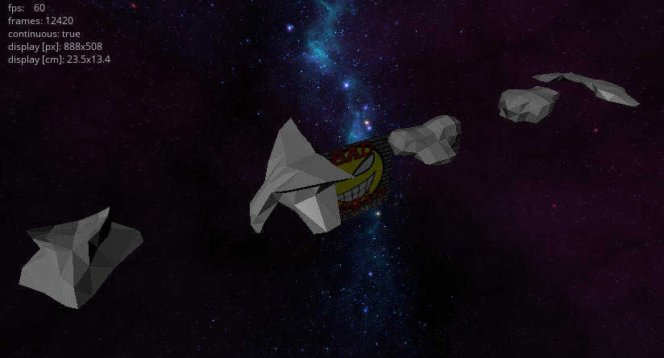
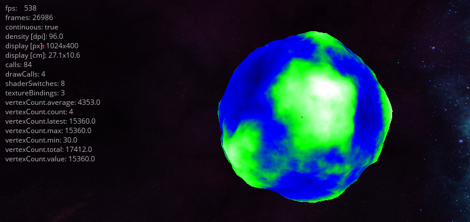
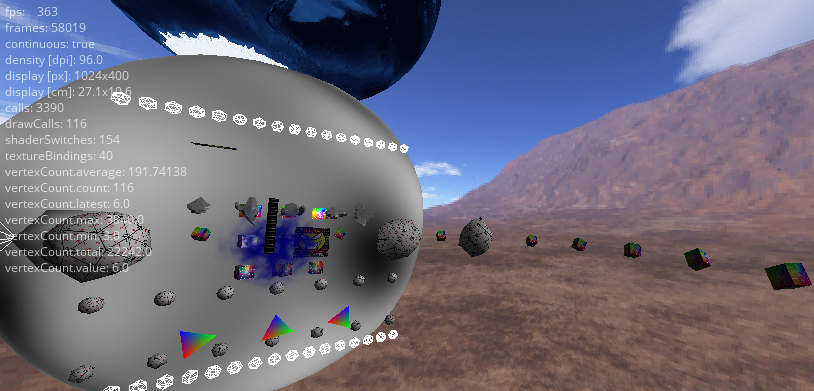

# Pluto Project

Pluto implements a simple Scene Graph based on LibGdx

in order to build you have to set up 
sdk.dir and retrolambda.jdk, retrolambda.oldJdk in local.properties

## Links and Resources

### libgdx
* [Chris/iXeption: Transition Effects](https://github.com/iXeption/libgdx-transitions)
* [Bloom Shader: Bloom Shader](https://code.google.com/p/bloom-lib/)

### OpenGl
* [Sean O'Neil: A Real-Time Procedural Universe](http://www.gamasutra.com/view/feature/131393/a_realtime_procedural_universe_.php)
* [Andrew True: Procedural Planets](http://archive.gamedev.net/archive/reference/programming/features/procplanet1/)
* [Shanee Nishry: Planet generation](http://www.shaneenishry.com/blog/2014/08/01/planet-generation-part-i/)
* [Christian Maher: Working with Simplex Noise](http://cmaher.github.io/posts/working-with-simplex-noise/)
* [swiped tutorial](https://github.com/mattdesl/lwjgl-basics/wiki/LibGDX-Finger-Swipe)

### assets and stuff
* [Music and Sound](http://soundimage.org/)

### ai
* [Behavior Trees](http://www.youtube.com/watch?v=n4aREFb3SsU)
* (https://github.com/gaia-ucm/jbt)
* [Chris Simpson: Behavior trees for AI: How they work](http://www.gamasutra.com/blogs/ChrisSimpson/20140717/221339/Behavior_trees_for_AI_How_they_work.php)

### net
* [Gaffer on Games](http://gafferongames.com/networking-for-game-programmers/)

## How to run on Desktop

* Download `desktop-0.1.jar` from [Releases](https://github.com/mwohlf/pluto/releases/latest)
* Start with `java -jar desktop-0.1.jar`

## Screenshots

